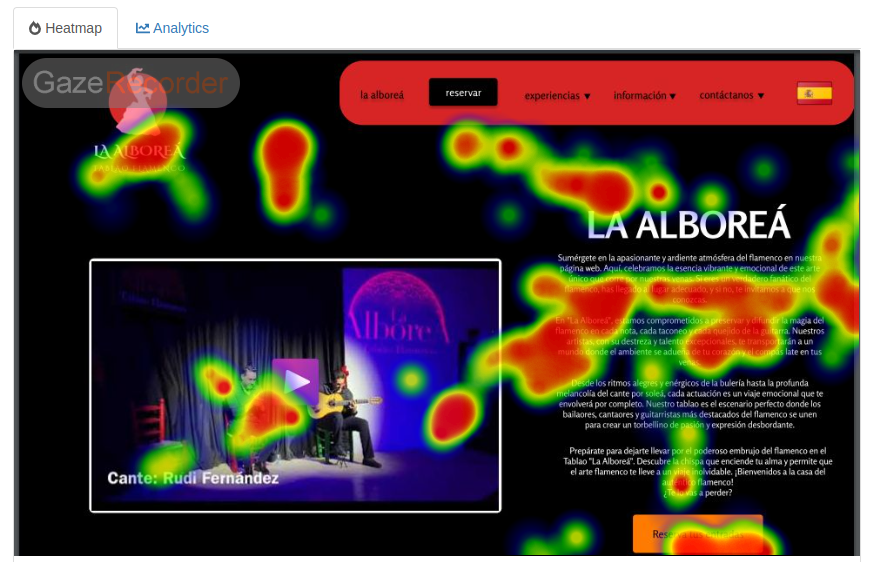
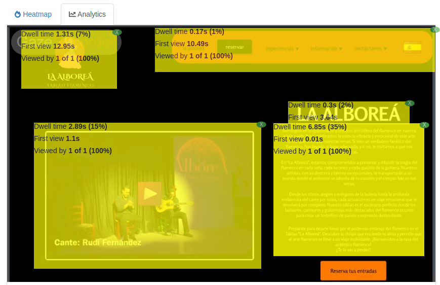
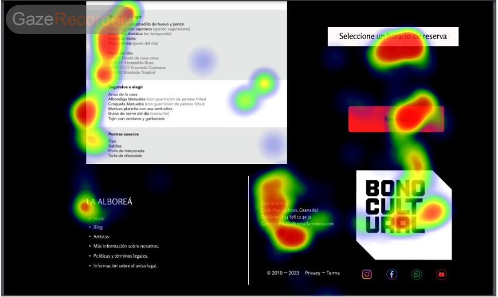
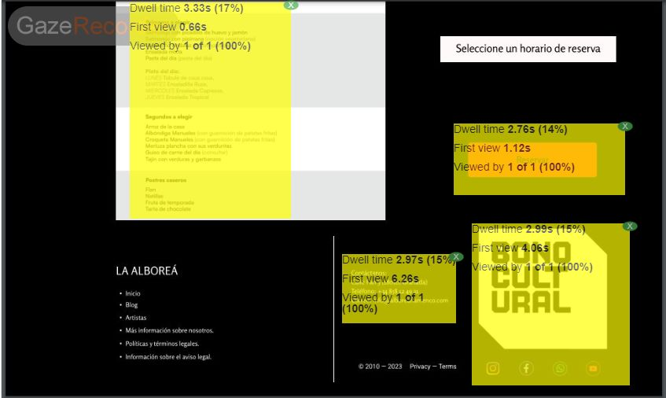
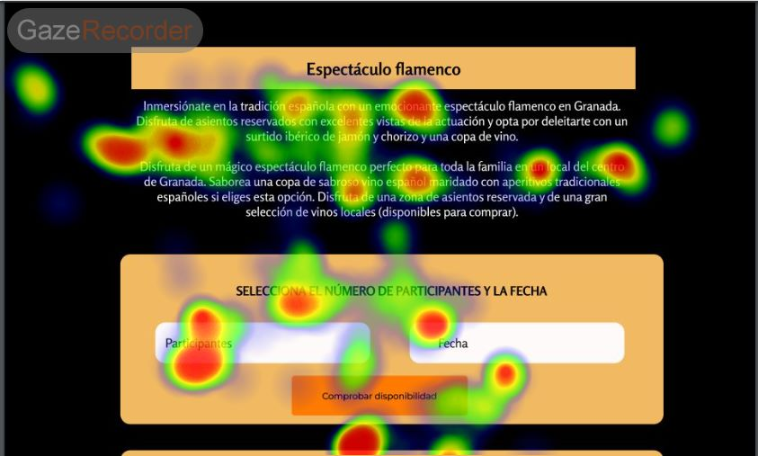
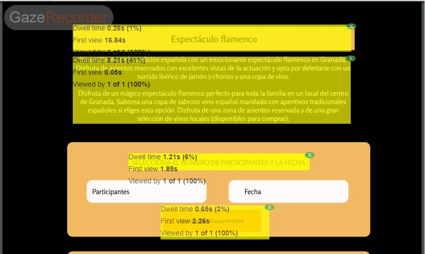

## Práctica 5: EYE TRACKING 

### 1. Diseño

##### Primera imagen

###### Heatmap

###### AOI

Como podemos comprobar, prácticamente toda la atención se centra en los elementos más visuales: el logo, el vídeo, y el texto. Sin embargo, podemos ver que, a pesar de ser tan largo el texto, el usuario solo ha dedicado 6 segundos a él, lo que claramente nos indica que no lo ha leído, quizás debido a que hay mucha densidad en poco espacio. Lo que sí podemos ver también es que ha sido la primera cosa que el usuario ha visto, posiblemente por la posición en la que se encuentra. Lo segundo que se ha visto ha sido el vídeo, y se ha dedicado muy poco tiempo a él. Quizás si se reprodujera automáticamente, el usuario tendría más interés en este. Al menú y al logo se les ha dedicado poco tiempo de visualización, quizás porque se acababa el límite de tiempo disponible y el usuario quería tener una imagen general de toda la página.

##### Segunda imagen

###### Heatmap

###### AOI

De nuevo en este caso, ninguna atención se ha centrado en el fondo debido a su oscuridad y poca atracción. El usuario ha dedicado todo su interés en las imágenes y los paneles coloridos. Llama la atención la poca visibilidad que ha tenido el texto inferior, debido a lo poco que destaca con respecto al fondo. Una posible mejora si se quiere atraer la atención del usuario, sería haberlo puesto con una tipografía de mayor tamaño, de distinto color, dentro de un cuadro, o con cualquier otro tipo de resaltado. Lo primero que se ha visualizado ha sido el panel del menú, debido a su tamaño y contraste con respecto al fondo, aunque tampoco se ha dedicado mucho tiempo a él, debido posibemente al tamaño de la letra. 

También llama la atención que tanto al logo del Bono Cultural como al botón de reservar, a pesar de tener muy poco texto e información se les ha dedicado bastante tiempo en comparación, lo que reafirma nuestra idea de que algo tan visual atrae mucho más la atención de los usuarios.

##### Tercera imagen

###### Heatmap

###### AOI

Este ejemplo es un poco distinto, ya que en él, por lo que parece, si se ha dedicado un tiempo a leer el texto que aparece, además de ser la primera cosa que se ha visto. De hecho, ha ocupado casi la mitad del tiempo que el usuario ha visto la página. Esto puede deberse a que no aparece mucha más información a la que prestar atención, además de tener el texto una tipografía bastante mayor al resto de casos, y verse mucho más claro.

### 2. Conclusiones

Como conclusión, está bastante claro que para llamar la atención de un usuario, es necesario disponer los elementos de forma clara y concisa, otorgándole importancia, por ejemplo, destacándolo con respecto al fondo. Además, podemos afirmar que pese a los pequeños errores ya comentados (el color del fondo y tamaño de la tipografía), en general el diseño propuesto por el grupo *Puntaleños* es bastante aceptable y tiene bastante potencial.

